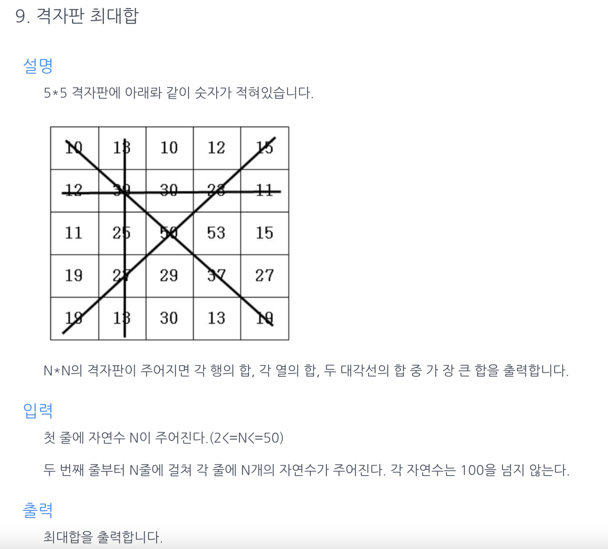

## 알고리즘 문제풀이 연습 - 5

## 

---

### 제출한 답안

```java
public class CodingTestApplication {

    public int solution(int count, int[][] inputArray) {

        int temp = 0;
        int answer = 0;

        for(int i=0; i<count; i++) {
            for(int j=0; j<count; j++) {
                temp += inputArray[i][j];
            }
            if(temp > answer) answer = temp;
            temp = 0;

            for(int k=0; k<count; k++) {
                temp += inputArray[k][i];
            }
            if(temp > answer) answer = temp;
            temp = 0;
        }

        for(int i=0; i<count; i++) {
            for (int j = 0; j < count; j++) {
                if (i == j) {
                    temp += inputArray[i][j];
                }
            }
        }

        if(temp > answer) answer = temp;
        temp = 0;

        for(int i=0; i<count; i++) {
            for(int k=0; k<count; k++) {
                if(i+k == count-1) {
                    temp += inputArray[i][k];
                }
            }
        }
        if(temp > answer) answer = temp;

        return answer;
    }

    public static void main(String[] args){
        CodingTestApplication main = new CodingTestApplication();
        Scanner in = new Scanner(System.in);

        int count = in.nextInt();
        int[][] inputArray = new int[count][count];

        for(int i=0; i<count; i++) {
            for(int j=0; j<count; j++) {
                inputArray[i][j] = in.nextInt();
            }
        }

        System.out.println(main.solution(count, inputArray));
    }
}
```

## 개선점

- 문제의 난이도는 평이했으나, 코드를 좀더 간결하게 작성할 수 있었음.

### 개선점 1

> 가로합, 세로합 연산 로직 통합

```java
TO-BE

for(int i=0; i<count; i++) {
    sum1 = sum2 = 0;
    for(int j=0; j<count; j++) {
        sum1 += array[i][j];
        sum2 += array[j][i];
    }
    answer = Math.MAX(answer, sum1);
    answer = Math.MAX(answer, sum2);
}
```

### 개선점 2

> 대각선 연산 로직 통합, 간결화

```java
TO-BE

for(int i=0; i<count; i++) {
    sum1 += array[i][i];
    sum2 += array[i][count-i-1];
}
```
